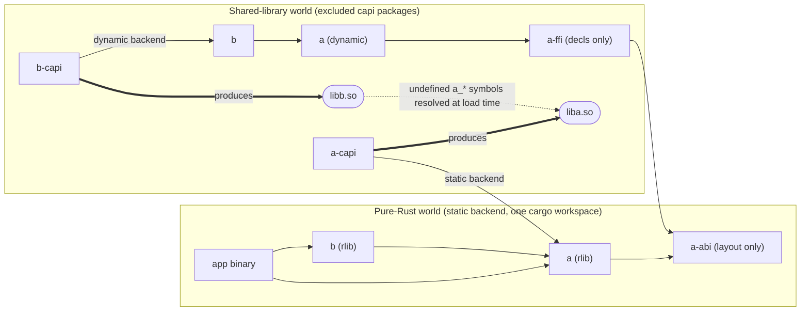
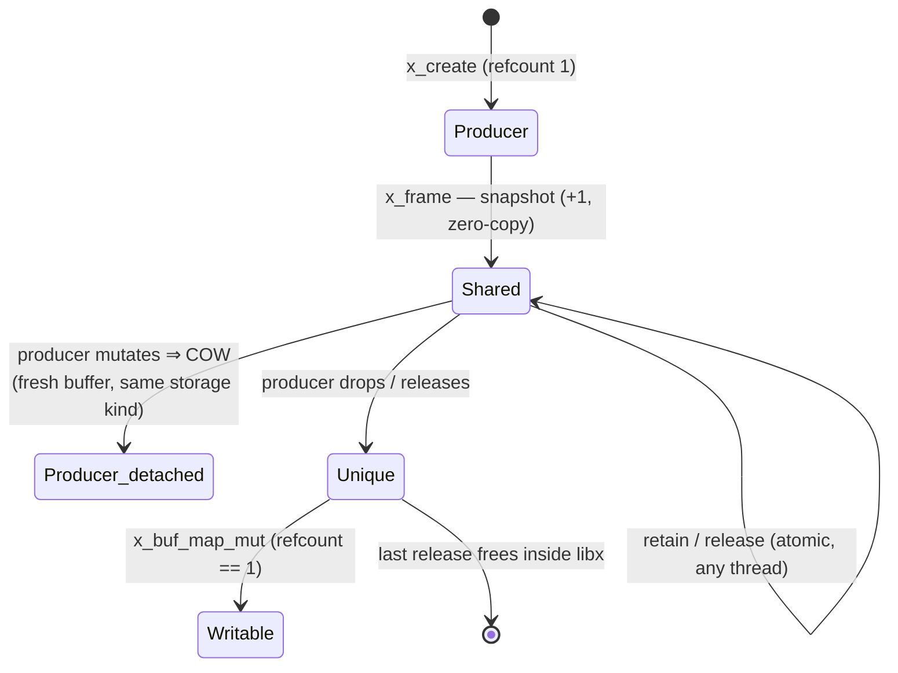
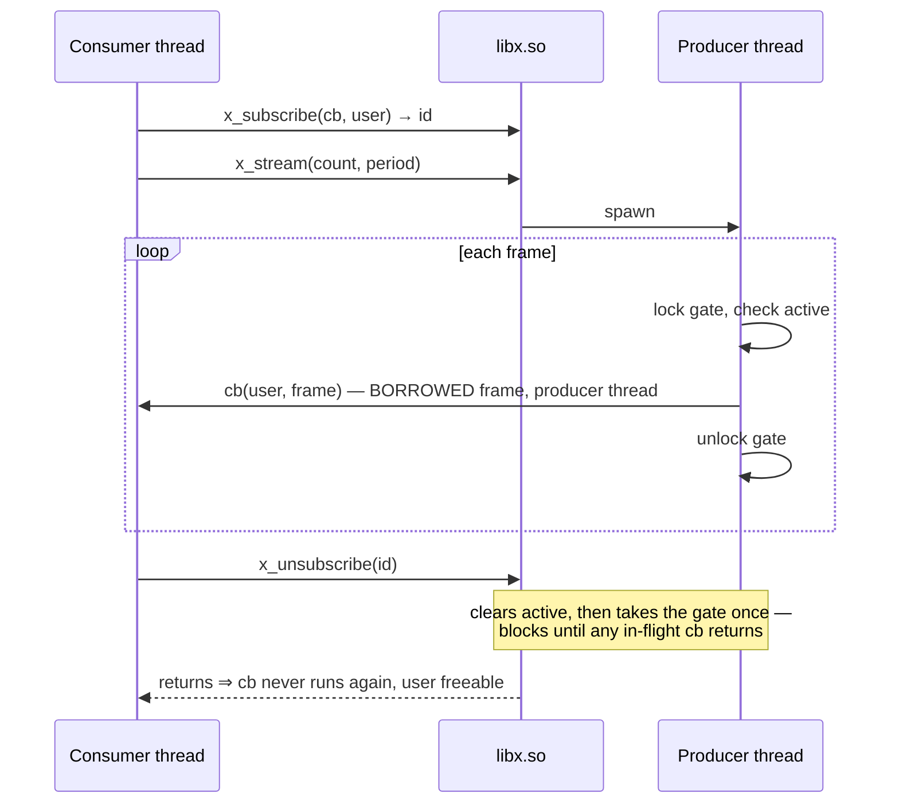

# Dual Rust/C API Shared Library Architecture

**Version 1.0** — 2026-08-23

> [!NOTE]
> Every claim in this document is validated by the reference implementation in this repository. The scripts that prove each one are named alongside it; `./run.sh` is the entry point.

## Contents

[The pattern](#the-pattern) · [Backend switch](#the-backend-switch) · [ABI contract](#the-abi-contract) · [Errors & panic shields](#error-handling-and-panic-shields) · [Buffers & zero-copy](#buffers-and-zero-copy) · [Callbacks, streaming, async](#callbacks-streaming-and-async) · [Python](#python-bindings-x-py) · [Mobile (BoltFFI)](#mobile-bindings-boltffi) · [.NET](#net-bindings-boltffi-multi-module) · [Workspace mechanics](#workspace-mechanics) · [Boundary rules](#boundary-rules) · [Replication checklist](#replicating-the-pattern-for-a-new-component-x) · [Validation techniques](#validation-techniques) · [Headers & conformance](#headers-and-conformance-checking) · [Versioning](#released-library-versioning) · [Alternatives](#alternatives-considered) · [Open items](#open-items) · [Changelog](#changelog)

## Problem

We ship a family of high-performance libraries where a type defined by component A is created in `liba.so` and consumed by `libb.so`. Each component must offer both a first-class Rust API and an ergonomic C API (opaque structs, accessors, builders). Rust's default model works against this: crates are statically linked and `#[repr(Rust)]` layouts are unstable, so when two cdylibs both depend on A's crate, each embeds its own copy of A's code and its own frozen idea of A's layout. The copies bloat the binaries and silently diverge as versions drift.

Goals:

- One home for each type's implementation — no duplicated code across `.so` files.
- A first-class Rust API with zero-cost static linking for pure-Rust consumers.
- An ergonomic, hand-designed C API per component.
- Shared libraries may drift in version independently as long as the C ABI contract holds.
- Keep `.so` artifacts as small as the toolchain allows.

## The pattern

Each component X splits into four crates by role, plus consumers:

| Crate | Role | Contains code? | Who links it |
| ------- | ------ | ---------------- | -------------- |
| `x` | First-class Rust API, feature-switched backend (`static`/`dynamic`/`vtable`) | Yes (static) / thin wrapper (dynamic, vtable) | Rust consumers, `x-capi` |
| `x-abi` | Layout-only contract: `#[repr(C)]` shared structs, versioned | No — pure type definitions | Everyone; duplication is free |
| `x-ffi` | Declarations-only `extern "C"` bindings to `libx.so` (the Rust "header") | No — only undefined symbols | `x`'s dynamic backend, other consumers of the C ABI |
| `x-cshim` | The C-ABI logic over the static backend: entry-point bodies, panic shield, last-error state. Optional — add it only when a second consumer needs the same bodies | Yes | `x-capi`, and `x-py`'s self-contained build |
| `x-capi` | cdylib producing `libx.so`: the exported symbol surface and the contract documentation (cbindgen's source); bodies forward to `x-cshim` | Thin forwarders — the sole home of X's code in the `.so` world | Nobody (leaf crate) |

`x-capi` and `x-ffi` are the two opposite sides of the same contract — the `.c` file and the `.h` header respectively. They can never merge: one defines the exported symbols, the other declares them as externally provided, and their dependency directions are opposite. Every `x-ffi` declaration must match the corresponding `x-capi` export exactly; a mismatch is silent undefined behavior, not a compile error — `check-abi.sh` verifies the name-level correspondence and the header-compiled harness the signatures (see Headers and conformance checking).

### Dependency and artifact graph (components A and B)



The critical property: nothing on libb.so's build path reaches A's implementation. `b-capi → b → a(dynamic) → a-ffi` ends at declarations, so the linker records undefined `a_*` symbols instead of embedding code.

## The backend switch

Crate `x` presents an identical public API under two mutually exclusive features; consumers like `b` are written once and are backend-agnostic.

- `static` (default): the real implementation is compiled in. Cargo unifies the dependency graph, so a pure-Rust application contains exactly one copy of X with full inlining and no shared-library dependency.
- `dynamic`: the public type is a `#[repr(transparent)]` newtype over the opaque FFI handle. Methods call through the C ABI; `Drop` calls the destroy function. Zero implementation code is linked.

```rust
// dynamic backend sketch
#[repr(transparent)]
pub struct A(NonNull<AHandle>);

impl A {
    pub fn id(&self) -> u64 { unsafe { a_id(self.0.as_ptr()) } }
    /// Borrow an A from a raw C handle for the duration of a callback.
    /// ManuallyDrop prevents ownership (and a_destroy) from being taken.
    pub unsafe fn with_raw<R>(p: Raw, f: impl FnOnce(&mut A) -> R) -> R {
        let mut a = ManuallyDrop::new(A(NonNull::new_unchecked(p)));
        f(&mut a)
    }
}

impl Drop for A {
    fn drop(&mut self) { unsafe { a_destroy(self.0.as_ptr()) } }
}
```

Each backend also exposes `type Raw` (the C-facing handle pointer type) so downstream capi crates can write backend-independent `extern "C"` functions. This is the same architecture as the `openssl-sys` vendored-vs-system switch: the feature selects where the implementation lives, never what the API looks like.

## The ABI contract

The contract between `libx.so` versions and their consumers consists of exactly two things; everything else may drift freely.

1. **Exported function signatures** — the hand-designed C API: create/destroy pairs, accessors, builders. Append-only: signatures are never changed or removed, only added.
2. **`x-abi` shared layouts** — optional `#[repr(C)]` "windows" for hot paths where per-field function calls are too expensive. Evolution rules, per struct:
   - A `version`/`size` header comes first; readers validate it.
   - Fields are append-only: existing offsets never move or change type.
   - New fields are carved out of a `_reserved` tail (or appended past `struct_size`).
   - This is the `struct sockaddr_storage` / Vulkan `sType` discipline.

Two access patterns follow, and a consumer chooses per call site:

- **Opaque handle** (default): every access is a function call into `libx.so`. Zero layout coupling; survives any implementation change.
- **Shared window** (hot paths only): one call fetches `*const XSharedV1`, then direct field reads. Coupled only to the frozen window layout, never to the private struct.

## Error handling and panic shields

Fallible C entry points return an `XStatus` code defined in `x-abi`: `Ok = 0`, errors negative, codes append-only. The wire type is plain `i32`, NEVER the Rust enum — a newer library may return a code an older consumer doesn't know, and materializing an unknown discriminant in a Rust enum is instant UB; consumers convert via `AStatus::from_code`, which maps unknown codes to a catch-all `Unknown` variant (treat like `Panic`). `Panic = -1` is reserved for internal invariant failures caught at the boundary; after receiving it, the object's state is unspecified and the only valid operation is destroy.

**A status code must distinguish outcomes that callers act on differently, or callers cannot act at all.** `InvalidArgument = -2` and `Unavailable = -4` both mean "your call did not happen", but one is a bug in the caller's code and the other is a fact about the machine, and the correct response differs completely: fix the call, versus skip the feature. Collapsing them is a real defect, not a stylistic one — `Storage::alloc` originally returned `Option`, so *"you named a storage kind this build does not know"* and *"this kind exists but there is no accessible `/dev/dma_heap` here"* arrived at the caller as the same code. Every platform-storage consumer therefore had to treat an unprivileged container as a test failure, and the C harness went further and segfaulted, because after the failed `a_set_storage` it kept going and dereferenced the `MAP_FAILED` its subsequent `mmap` returned — discarding all 100+ results it had already printed. The split is what lets `harness/main.c` carry a `SKIP` macro alongside `CHECK`, and report `PASS (0 failures, 2 skipped)` on a box without a dma-heap while still failing loudly on an unsupported *kind*. This was also the second worked example of the append-only rule (`Busy` was the first): a new code changes no layout, so `A_ABI_VERSION` does not move, and an older consumer maps `-4` to `Unknown` and treats it as fatal — safe, it merely loses the skip hint. Simple accessors (`x_id`, `x_counter`) stay infallible by contract — passing an invalid handle is UB, as in any C API — while entry points that validate arguments or can fail internally return `XStatus`.

Unwinding must never cross `extern "C"` (it aborts the process at best, is UB at worst), so fallible entry points wrap their bodies in a panic shield:

```rust
fn shield(f: impl FnOnce() -> AStatus) -> AStatus {
    std::panic::catch_unwind(AssertUnwindSafe(f)).unwrap_or(AStatus::Panic)
}
```

Validated: a deliberately panicking export (`a_test_panic`) returns `Panic` to the C harness instead of taking down the process, and leaks nothing. Production capi crates should also install a quiet panic hook (the default prints to stderr). The Rust surface is backend-symmetric: `fn try_fill(&mut self, ..) -> Result<(), AStatus>` behaves identically whether the validation happens in-process (static) or across the ABI (dynamic).

> [!WARNING]
> The shield only works under `panic = "unwind"`. The size-optimized `release-small` profile uses `panic = "abort"`, which trades the shield away: an internal panic aborts the process. Pick per deployment.

## Buffers and zero-copy

Bulk data (frames, tensors, point clouds) crosses the boundary under four models, all validated in the prototype from both C and safe Rust. A component's C API typically offers all of them; consumers choose per call site.

| Model | Ownership | Copies | Contract |
| ------- | ----------- | -------- | ---------- |
| Borrowed view | Producer keeps it | 0 | View valid until the producer is mutated or destroyed |
| Refcounted snapshot | Shared, refcounted in `libx.so` | 0 (until COW) | Valid while the caller holds a reference; immutable |
| Exclusive write | Sole reference holder | 0 | Writable view granted only while the refcount is exactly 1 |
| Caller-provided | Caller owns the buffer | 1 | None — bytes are the caller's after the call returns |

### Borrowed views

`x_data(h)` returns a `#[repr(C)] XBufView { ptr, len }` (defined in `x-abi`) pointing into the producer's memory. The C contract is temporal — the view is invalidated by any mutation or destroy. The Rust API upholds the same rule statically: both backends expose `fn data(&self) -> &[u8]` with the lifetime tied to `&self`, so use-after-mutate is a borrow-check error rather than a documentation footnote. For richer data, extend the view struct (stride, format, plane count) under the usual `x-abi` append-only rules.

### Refcounted snapshots

`x_frame(h)` returns an opaque `XBuf*` carrying one reference; `x_buf_retain`/`x_buf_release` manage the count and `x_buf_map` returns a view valid while a reference is held. This is the `GstBuffer`/`CVPixelBuffer` model, and it is what lets a consumer library hold data alive independently of the producer object's lifetime — validated: the frame stays intact after `x_destroy` of its producer, across the `.so` boundary, with zero leaks.

The Rust implementation is deliberately thin: the static backend stores the payload as `Arc<Vec<u8>>`, and the C ABI maps directly onto std (`retain` → `Arc::increment_strong_count`, `release` → `Arc::decrement_strong_count`). Mutation goes through `Arc::make_mut`, which yields **copy-on-write**: if snapshots are outstanding, the producer detaches onto fresh memory and snapshots keep their bytes. A COW detach of a platform buffer can fail at runtime (heap exhausted, dma_heap unavailable); that falls back to heap storage rather than panicking across the boundary — the snapshot keeps its platform buffer, and the producer's next `a_buf_export` reports `A_STORAGE_HEAP`. COW-on-mutate is therefore part of the ABI contract — snapshots are immutable, and a producer mutation after `x_frame` costs one copy. The dynamic backend wraps `XBuf*` in a `repr(transparent)` `Frame` whose `Clone`/`Drop` call retain/release, giving Rust consumers identical value semantics in both backends. `Frame` is `Send + Sync` (atomic refcount, immutable contents); its `into_raw`/`from_raw` transfer references to and from C without touching the count.

### Exclusive write access

`x_buf_map_mut(b)` returns a writable view whose pointer is null unless the caller's reference is the only one — `Arc::get_mut` semantics exported through the C ABI. This turns Rust's uniqueness rule into a runtime check C callers can rely on: while a buffer is shared, writes are refused; once the producer detaches (COW) or releases, the sole holder may write in place, zero-copy. The Rust surface is `fn data_mut(&mut self) -> Option<&mut [u8]>`, where `&mut self` enforces API-level exclusivity and the `Option` reports refcount-level uniqueness. Validated from C and Rust: refusal while shared, grant + in-place write once unique.

### Shapes and strides

Buffers with structure (frames, tensors) carry their geometry in the contract: `AFrameInfoV1 { rows, cols, channels, row_stride }` in `x-abi`, returned by `x_buf_info`. The row stride is in bytes and may exceed `cols × channels` — the prototype deliberately uses 32×30×4 with a 128-byte stride, so buffers are **not** C-contiguous and consumers are forced to honour strides rather than assume density. Geometry travels with the refcounted payload (snapshot and producer always agree), and adding `x_buf_info` exercised the append-only evolution path of both the C ABI and the capsule vtable.

### Caller-provided buffers

`x_copy_data(h, out, cap) -> written` — the boring model, but part of a complete C API: no lifetime contract survives the call, at the price of a copy. The Rust surface is `fn copy_data(&self, out: &mut [u8]) -> usize`.

### Buffer boundary rules

- All refcount operations execute inside `libx.so` (allocation symmetry applies to buffers too); a buffer obtained through any consumer library is still released via `x_buf_release`.
- Views are never stored by consumers beyond their validity window; anything longer-lived takes a snapshot.
- Snapshots are immutable while shared; in-place writes require the exclusive-write model (unique reference).
- Exported descriptors (fd / IOSurfaceID) are READ-ONLY for receivers by contract: an external writer would race the implementation's `&[u8]` view of the same pages — the platform cannot enforce this (the fd is writable, the surface globally mappable), so it is a documented rule, restated at the `unsafe impl Send/Sync` sites in `storage.rs`.
- By-value ABI structs (`ABufView`, `AFrameInfoV1`, `AFrameDescV1`) are frozen forever — their size is baked into consumer call sites, so they evolve by suffixed successors, never by reserved-tail growth. **Worked in the prototype**: `AFrameDescV2` + `a_buf_export2` add DRM fourcc, format modifier and geometry. Both entry points live forever; the harness calls both from one TU. Keeping v1's fields as a layout-identical prefix is convention rather than requirement — it costs nothing, lets a consumer read a v2 descriptor through a v1 pointer, and `gen-header.sh` asserts every shared offset so the property cannot rot.



### Platform buffer objects: DMA-BUF and IOSurface

Validated on both platforms: frame storage is a `Storage` abstraction inside the implementation — `Heap(Vec<u8>)`, Linux `DmaBuf` (allocated from `/dev/dma_heap/system` or `linux,cma` via `DMA_HEAP_IOCTL_ALLOC`, CPU-mapped with `mmap`), or macOS `IoSurface` (created via the plain-C IOSurface framework, kept CPU-locked; ~60 lines of hand-declared externs each, no crate dependencies beyond `libc`). Because every kind exposes the same byte-slice view, **all existing machinery — views, refcounted snapshots, COW, exclusive write, streaming — is storage-agnostic and needed zero changes**; COW clones allocate the *same* kind, so a snapshot of a dma-buf frame detaches onto its own dma-buf.

The C surface: `x_set_storage(h, kind)` reallocates the payload in a kind (`InvalidArgument` where unsupported — kinds are platform-gated at runtime, not compile time), and `x_buf_export(b)` returns `XFrameDescV1 { kind, fd, id, offset, len }`:

**CPU access is bracketed** (`Storage::read` / `Storage::write` RAII guards): dma-buf issues `DMA_BUF_IOCTL_SYNC` `START`/`END` tagged READ or READ|WRITE, IOSurface takes a per-access lock, heap is a no-op. This is cache maintenance, not mutual exclusion — it is what makes CPU reads of device-written data coherent on SoCs where the device is not cache-coherent with the CPU.

That bracket applies to accesses **this library** performs (fill, copy, COW). It deliberately does not apply to the zero-copy borrowed views (`a_data`, `a_buf_map`), and the reason is a genuine design constraint worth stating: **a lock scope and a borrowed-view contract are different shapes.** The view contract hands out a pointer valid "until the producer is mutated or destroyed"; a lock is valid until it is released. So the IOSurface path keeps a lifetime lock (per-access locks nest inside it — IOSurface lock counts are per process) to keep exported pointers valid, and leaves cache maintenance for the view's own window to whoever reads through it — exactly what the kernel's dma-buf API asks of an importer. Per-access locking *only* would mean replacing the borrowed-view model with a scoped map/unmap API: a different C ABI, not an implementation detail.

**Storage kind is selectable per output, not just per producer.** `a_set_storage` reallocates the producer's own working payload; `a_set_frame_storage` chooses the kind for frames it subsequently *emits* (`a_capture`, `a_stream`). A capture pool feeding a GPU importer wants device buffers whether or not the producer's scratch buffer is one. Unsupported kinds fail eagerly at selection rather than silently downgrading every later frame to heap, where no one checks the return value.

- `DMABUF`: `fd` is a **dup'd fd owned by the caller** — mmap it, or import into DRM/V4L2/EGL; `DMA_BUF_IOCTL_SYNC` applies around CPU access to device-written data. Proven on the imx95-pro board: the harness mmaps the exported fd independently and reads liba's bytes.
- `IOSURFACE`: `id` is the **global IOSurfaceID** — `IOSurfaceLookup(id)` resolves it in any process (lock before CPU access). Proven natively: the harness looks up the exported ID and reads liba's bytes.

Cross-compile/on-target workflow (`cross-test.sh`): `cargo zigbuild --target aarch64-unknown-linux-gnu` for both capi packages, `zig cc -target aarch64-linux-gnu` for the C harness with `-Wl,-rpath,$ORIGIN`, scp to the board, run. One lesson learned the empirical way: **without a SONAME, ELF consumers record the literal link-time path** of liba.so as their dependency and fail to load when deployed — the capi build scripts now set `-Wl,-soname,libx.so` on Linux (a release would use `libx.so.MAJOR`), turning the doc's soname policy from advice into enforced practice.

## Callbacks, streaming, and async

Data flowing *from* the library to consumers (frame streams, completion events) crosses the boundary as C function pointers plus a `user` context — validated end-to-end from a real producer thread inside libx into C, Rust, and Python consumers, in every backend.

### The C callback contract

- **Thread**: callbacks run on an internal producer thread, never the registering thread. `user` must be usable from that thread.
- **Two ownership conventions, by shape**: a *subscription* callback (`x_subscribe(cb, user) -> id`, repeated deliveries) receives the frame **borrowed** for the call — retain to keep it. A *completion* callback (`x_capture(cb, user)`, invoked exactly once) receives the frame **owned** — async-result semantics; the callee releases it.
- **Teardown is a guarantee, not a hope**: `x_unsubscribe` blocks until any in-flight invocation returns, and after it returns the callback will never run again — so the subscriber may immediately free `user`. Implementation: each subscription has an active flag plus a gate mutex held for the duration of every invocation; unsubscribe clears the flag, then takes the gate once. The matching restriction is documented: **never call `x_unsubscribe` or `x_stream_join` from inside a callback** (self-deadlock by construction). Delivery/teardown locks are poison-tolerant, so one panicking subscriber cannot wedge the others.
- **Destroy is full teardown**: `x_destroy` joins any active stream and then runs the unsubscribe protocol for every remaining subscription — after it returns, nothing is in flight and nothing will fire (it may block for the stream's remainder). Consumer-side closure resources (the Rust backends' trampoline boxes) are freed on the same guarantee.



### Backpressure: who waits when a consumer is slow

Delivery defaults to **blocking**: the producer thread calls each callback directly, nothing is dropped, and a slow subscriber slows the stream *for every subscriber*. That is correct for a recorder and wrong for a live preview, so the policy is per-subscription (`a_subscribe_with`, `A_DELIVERY_*`):

| Policy | Producer | Loss | Fits |
| -------- | ---------- | ------ | ------ |
| `BLOCKING` (default) | invokes the callback itself, waits for it | none | recorders, anything that must see every frame |
| `LATEST` | hands the frame to a per-subscription pump thread and moves on | oldest frame dropped when a newer one arrives first | live preview, display, anything that wants *current* over *complete* |

`LATEST` is a one-slot mailbox with overwrite, not a deep queue — for a live consumer a queue deeper than one is a latency buffer that fills with frames nobody will ever want. Drops are **counted** (`a_sub_dropped`): a struggling consumer must be distinguishable from a healthy one, and silent loss makes them identical.

The teardown guarantee is unchanged in both modes, which is the property that mattered most to preserve: `a_unsubscribe` clears the active flag, wakes and **joins** the pump thread, then takes the delivery gate once. Joining is what makes "will never run again" true rather than merely likely.

Unrecognised policies fall back to blocking rather than being refused — a newer library must never silently stop delivering to an older consumer.

### Cancellation: signalling through the argument

`a_capture2` returns an id and `a_capture_cancel` cancels it. The design question is what "cancelled" looks like to a callback that the whole trampoline model assumes is **invoked exactly once** — that invariant is what lets every consumer free its context box unconditionally. So cancellation is signalled *in the argument*: the callback still runs exactly once, with a NULL frame. Not calling it would have meant every trampoline needed a second, out-of-band path to free its box.

`a_capture_cancel` **blocks** until the callback has run, matching `a_unsubscribe`. A non-blocking cancel would leave the consumer with no moment at which its context is provably dead. Cancelling an id that already completed reports `InvalidArgument`: a capture finishing just before you cancel it is an ordinary race, not a fault.

`a_capture` keeps its original `void` signature forever — the id-returning form is a *new entry point*, because changing an exported signature is not evolution.

### Rust: closures and runtime-agnostic futures

The Rust surface is identical across backends: `subscribe(impl FnMut(Frame))`, `capture_cb(impl FnOnce(Frame))`, and `async` `capture()`. In the dynamic/vtable backends, closures cross the ABI as `Box<Box<dyn FnMut(Frame)>>` behind an `extern "C"` trampoline; the completion trampoline frees its box on its single invocation, and the subscription box is freed right after `x_unsubscribe` — sound *because of* the teardown guarantee above. `capture()` adapts the completion callback into a `Future` with a ~50-line waker-correct oneshot — no tokio, no runtime dependency; the library composes with whatever executor the application runs (the prototype's app uses a 20-line park/unpark `block_on`). Crate `b` demonstrates layered composition: `b::capture_checksum` is an `async fn` (and a callback twin for `b-capi`'s C export) built on the backend-agnostic `a::A::capture`.

One trap worth naming: Rust 2021's disjoint field capture will move a raw pointer *field* out of a `Send` wrapper struct into the closure, silently dropping the `Send` justification — force whole-struct capture (`let user = user;`) in trampoline closures.

`A::frames(capacity)` turns a subscription into an **async iterator** (`FrameStream`, with an inherent `async next()`), bounded and drop-oldest. It is written once and compiled into all three backends, because it uses nothing but `subscribe_with` — whose signature is identical in every backend. `futures_core::Stream` is deliberately not implemented: the point of this async story is composing with any executor without depending on one, and the trait is a ten-line adapter in whatever crate already has `futures-core`.

A limitation worth stating rather than hiding: `FrameStream` does **not** unsubscribe on drop. It cannot — the subscription lives in an `A` the stream holds no reference to, and a `'static` stream borrowing it would not compile. Teardown is the caller's (`a.unsubscribe(stream.id())`), exactly as for a raw subscription. Making drop-unsubscribe work would mean restructuring `A` to be internally `Arc`-based so the stream could hold a weak handle: a real design option that trades the current zero-overhead ownership model for convenience at this one surface.

### Python: callbacks and asyncio

`x.subscribe(callable)` invokes the Python callable from the producer thread (attaching to the interpreter per delivery; exceptions are reported via `sys.unraisablehook` and the stream continues). The rule that makes this sound: **any GIL-holding call that waits for the producer must release the GIL first** — `stream_join`, `unsubscribe`, and `stream` (whose implicit join of a previous stream is easy to miss) all detach internally, otherwise the producer blocks waiting for the GIL inside a callback while the main thread blocks waiting for the producer. Two lifecycle rules bind the application: join streams and let captures resolve before interpreter exit (a producer thread attaching to a finalizing interpreter is killed mid-frame by CPython), and never reload module `a` while consumers hold its capsule (b pins the capsule object to keep the payload alive; single interpreter only). Async needs no runtime dependency either: `await x.capture()` and `await b.capture_checksum(x)` return genuine asyncio futures, resolved from the producer thread via `loop.call_soon_threadsafe` through a cancellation-guarded helper (the `run_coroutine_threadsafe` convention: set the result only if not cancelled, discard silently if the loop already closed) — validated including `asyncio.gather` and a timed-out capture leaving no loop exception behind. `.pyi` stubs ship beside the test battery. The streaming/capture entries are capsule contract v3 (appended vtable fields, min-version check).

## Python bindings (x-py)

Each component may ship a Python extension module (`crates/x-py`, PyO3) as another leaf binding crate — the Python sibling of `x-capi`. Two facts make extension modules a special case of the pattern:

- **The OS linker trick doesn't apply between modules.** Python dlopens extension modules `RTLD_LOCAL`, so undefined symbols in `b`'s module cannot resolve from `a`'s module. Cross-module sharing must go through either a real shared-library dependency (`DT_NEEDED` on `libx.so`) or Python-level machinery.
- **A pyclass registered twice is two different Python types.** The `a.A` class must live in exactly one module (`a-py`); module `b` can never define its own copy and downcast foreign objects to it.

Both are solved with the CPython **PyCapsule** convention (numpy's `_ARRAY_API`, `datetime`'s CAPI): module `a` publishes `a._C_API`, a capsule holding a `repr(C)` record from `x-abi` — append-only and versioned like every other contract:

- `APyCapiV1.with_a(PyObject*, cb, user) -> AStatus` (capsule v5, the entry consumers should use) — type-checks an object *inside module a* (where the one pyclass lives), then invokes `cb` with its handle **while module a still holds the pyclass's exclusive borrow**. Because the borrow outlives the handle's window of use, the handle's provenance stays live for exactly as long as the consumer uses it. Returns `InvalidArgument` for a foreign object, `Busy` if it is already borrowed, `Panic` if `cb` unwound.
- `APyCapiV1.unwrap_a(PyObject*) -> *mut AHandle` (capsule v1, **superseded**) — same type check, but returns the handle and drops its borrow guard, so the handle is exclusive only for as long as something *else* serializes access. Under CPython that something is the GIL. Retained for pre-v5 consumers; see [the free-threading discussion](#the-gil-is-load-bearing-and-why-with_a-replaces-unwrap_a).
- `APyCapiV1.vtable: *const AVtableV1` — the full C API as a function table, enabling linker-free access to the implementation.

Module `b` imports the capsule once (importing `a` as a side effect, which guarantees the implementation is loaded), verifies `abi_version`, then unwraps incoming objects and runs crate `b`'s ordinary Rust logic on them — a bogus argument raises `TypeError`, and payload bytes never enter Python.

### Packaging (`package.sh`)

`cargo-c` produces the versioned library, the symlink layout, and pkg-config files; `package.sh` then installs into a staging prefix and **builds a consumer against the installed tree using nothing but pkg-config**, with the same `-Wall -Wextra -Werror` the harness gets. Header generation stays with `gen-header.sh`, which also *proves* the header — cargo-c is handed that file as an install asset (with `generation = false` it will otherwise report "Installing header file" and install nothing).

Four things this made concrete:

- **Export trimming survives cargo-c.** The version script is applied by the capi build script, which cargo-c runs like any other; verified rather than assumed, since a cdylib leaking its Rust runtime is a correctness bug, not untidiness.
- **A DESTDIR-staged tree is not runnable in place, and that is correct.** The library records the *final* prefix in its `install_name`/soname, which is exactly what lets an installed consumer find it with no rpath. An rpath does not help a staged tree because the recorded path is absolute; DESTDIR exists to build a package, not to run from.
- **Pre-1.0 versioning works out as documented**: ld64 rejects a 0 major in `-compatibility_version`, so the install name is `liba.0.1.dylib` — MINOR as the compatibility axis until 1.0.
- **How libb's dependency on liba is expressed differs by platform, and not cosmetically.** On ELF it is a `DT_NEEDED` on liba's versioned soname. On Mach-O, consumer cdylibs link with `-undefined dynamic_lookup`, which by design records *nothing* — so pkg-config's `Requires:` is not redundant metadata there, it is the only copy of the dependency.

### Two deployment variants, same sources

The vtable makes a **third backend** for crate `x` natural: `vtable`, identical public surface, every call dispatched through an installed `AVtableV1` (`init_vtable` at capsule import). Feature selection then yields two deployment shapes:

| Variant | a-py backend | b-py backend | Needs libx.so | Fit |
| --------- | -------------- | -------------- | --------------- | ----- |
| Shared library | `dynamic` (links libx.so; vtable entries are the linked symbols) | `dynamic` (links libx.so) | Yes | System deployments where libx.so is installed anyway |
| Self-contained | `static` (implementation embedded; vtable entries are local wrappers) | `vtable` (no libx link at all) | No | pip wheels — `a` and `b` installable alone |

Validated: both variants pass identical Python tests (creation in `a`, mutation and zero-copy checksum from `b`, `TypeError` on foreign objects); the self-contained `b` module has zero undefined `a_*` symbols and `a`'s module no libx dependency; and in the shared variant, rebuilding only libx.so with a drifted implementation leaves the already-built Python modules passing untouched.

Costs to know about: the one-implementation-home rule moves to *deployment* discipline in the self-contained variant (the home is `a`'s module — don't also load libx.so consumers in the same process with a different version); the static `a-py` build and `a-capi` need identical C-ABI bodies, which live once in `a-cshim` (see below); and the original `unwrap_a` contract assumed the GIL serializes access, which `with_a` (capsule v5) removes the need for — see below.

### Frames in Python: the buffer protocol

`a.Frame` (pyclass in `a-py`, the type's single home) implements `__getbuffer__`/`__releasebuffer__`, exporting frames zero-copy into `memoryview` and numpy with full shape/stride fidelity — validated: `np.asarray(frame)` yields a read-only `(32, 30, 4)` uint8 ndarray with strides `(128, 4, 1)`, non-contiguous, whose data pointer equals the frame's bytes (no copy). The design rules:

- **Lifetime chain**: every exported buffer sets `Py_buffer.obj` to an owned reference to the `Frame` object, so `memoryview`/`ndarray` → `PyFrame` → implementation refcount keeps the bytes alive after *every* other reference is dropped (validated by `del`-ing the producer and the frame under a live view). Per-view shape/stride arrays are heap-allocated in `__getbuffer__` and freed in `__releasebuffer__` via `view.internal`.
- **Read-only, always**: Python-visible frames are immutable snapshots; `PyBUF_WRITABLE` requests raise `BufferError` (COW would silently detach a writable view from the producer — refusing is honest). Exclusive-write stays a Rust/C-level facility.
- **Non-contiguous means strided-or-nothing**: requests without `PyBUF_STRIDES` are refused rather than served a densified copy; `Py_buffer.len` is the logical size (shape product), excluding row padding.
- **Cross-module construction**: `b.grab_frame(x)` returns an `a.Frame` built inside module a via the capsule's `wrap_frame` (an appended v2 field — consumers check `abi_version >=`, never `==`, which is what makes append-only evolution work). `wrap_frame` consumes its buffer reference *unconditionally* — on failure it has already been released; a "caller keeps ownership on failure" variant is a double-release trap because the wrapping object's drop already runs.
- **Unwrap is a scoped exclusive borrow**: `with_a` takes the pyclass's mutable borrow (`try_borrow_mut`) and **holds it across the consumer's callback**, so the handle carries write provenance for its whole window of use and a conflicting borrow yields a clean `Busy` instead of a second aliasing handle. The older `unwrap_a` drops that guard on return and leans on the GIL for the rest — see below.
- **ABI mode**: `a-py` is `abi3-py311` — one wheel for 3.11+. The floor is set by the buffer-protocol slots (`bf_getbuffer`/`bf_releasebuffer`), which only entered the limited API in 3.11; `b-py` needs none of that and sits lower (`abi3-py39`). On platforms still shipping older interpreters — NVIDIA JetPack is the usual example — the fallback is a per-interpreter build of `a-py` (`PYO3_PYTHON`) with `b-py` staying abi3, which is exactly the split mode the capsule already supports. What you lose below 3.11 is the zero-copy `memoryview`/numpy path, not a detail.
- **Free-threaded builds are a third row, not a flag on the first two.** abi3 and PEP 703 are mutually exclusive today, and PyO3 does not error on the combination — it *silently drops* the abi3 request when the target interpreter is free-threaded, so the artifact is version-specific whether or not you noticed. The resulting matrix resolves itself, because installers pick the most specific matching tag:

  | Interpreter | Gets | Notes |
  | ------------- | ------ | ------- |
  | GIL, 3.11+ | the existing single `cp311-abi3` wheel | unchanged; free-threading costs it nothing |
  | a free-threaded version you chose to build | `cp314-cp314t`, etc. | version-specific, full parallelism |
  | any other free-threaded | sdist, built against that interpreter | the graceful fallback |

  Two notes on direction. The fallback for a free-threaded interpreter is **source**, never abi3 — a free-threaded 3.14 advertises 1,350 tags and not one plain `cp3xx-abi3` among them. And the per-version rows are temporary: the same interpreter advertises 559 **`abi3t`** tags, a free-threaded stable ABI added in 3.14 that will eventually collapse them into a single wheel. PyO3 0.26 cannot emit it yet, so the matrix shrinks later without breaking anyone who installed the version-specific artifacts. One constraint also *relaxes* on these rows: the free-threaded builds are not limited-API at all, so the 3.11 buffer-protocol floor simply does not apply to them.

### Garbage collection: callbacks the collector cannot see

A subscribed Python callable is owned by a Rust closure inside the subscription. CPython's collector cannot traverse Rust, so a callback that captures its own producer forms a cycle nothing can break — the classic extension-module leak.

The fix is `__traverse__`/`__clear__`, with one detail that decides whether it works: **each callable must be stored exactly once.** The GC subtracts one from an object's refcount per `visit.call`, so visiting fewer times than you actually hold leaves the cycle uncollectable (a silent leak), and visiting more times than you hold makes the collector free a live object (a crash). Here the callable lives in a single shared slot that both the pyclass and the delivery closure reference, so there is exactly one strong reference and exactly one visit. `__clear__` drops it — deliberately *without* unsubscribing, because `unsubscribe` blocks on in-flight callbacks that need the GIL while `__clear__` runs holding it.

The slot is a mutex whose lock is only ever taken by a thread that already holds the GIL (deliveries attach to the interpreter first, then lock). That ordering is what lets `__traverse__` take the lock without risk of blocking: a GC pass holds the GIL, so nothing else can be inside it. It is also one more GIL argument to revisit for free-threaded builds.

**A consequence worth stating plainly**: a subscriber callback must not touch the producer object while a `&mut self` method (`stream`, `stream_join`, `unsubscribe`) is running, because PyO3 holds an exclusive borrow of the pyclass for that whole call — including the part where the GIL is released and the producer thread delivers. A callback reading `x.counter` there gets a clean `RuntimeError` rather than a data race. That is Rust's aliasing rule surfacing through the binding, not a PyO3 wart: two threads really are touching one object, one of them mutably. Callbacks should capture what they need, not the producer.

### Where the C-ABI bodies live: `a-cshim`

Two consumers need byte-identical C-ABI logic over the embedded implementation: `a-capi`, which exports it as liba.so's symbols, and `a-py`'s self-contained build, which puts it in the capsule vtable where the OS linker is not involved at all. They cannot share by one depending on the other — `a-capi` is a cdylib leaf whose `#[no_mangle]` symbols must never enter another module's binary — so an rlib between them is the only place the logic can live once.

The split is decided by a tooling constraint worth knowing: **cbindgen parses `a-capi`'s source and neither expands macros nor follows calls.** So the exported signatures and their doc comments (which become the header's documentation, carrying the ownership and thread contracts) must be written out literally in `a-capi`. What can move is everything else. Hence:

- `a-cshim` — bodies, panic shield, thread-local last-error, and the ready-made `AVtableV1`. Everything takes the *opaque* `a-abi` handle types, so the vtable is a plain struct literal rather than a second set of wrappers.
- `a-capi` — `#[no_mangle]`, the literal signatures over crate `a`'s concrete types, the contract docs, and one-line forwarders.

Before this split the self-contained `a-py` build carried its own copy of all 25 wrapper bodies; the drift risk was exactly the kind this architecture exists to eliminate, one level up.

### The GIL is load-bearing, and why `with_a` replaces `unwrap_a`

The original capsule entry returned a handle: module `a` took `try_borrow_mut()`, called `as_raw_mut()`, and returned the pointer — dropping the borrow guard on the way out. Module `b` then mutated through that pointer. Nothing held the object between those two steps; what kept it exclusive was that no other Python thread could run at all.

That is a **point-in-time check, not a held lock**, and the distinction is invisible until the GIL goes away. Under free-threaded CPython (PEP 703) two threads can call `b.process(x)` on the same object simultaneously: the second `try_borrow_mut()` succeeds, because the first thread's guard is long gone, and two `&mut A` alias one object.

This is not a theoretical concern — it is mechanically confirmed. `crates/app/tests/scenarios.rs` models the borrow shape at the Rust level (Miri cannot run CPython) and **both aliasing models reject it**:

```text
Stacked Borrows: <tag> created by a SharedReadWrite retag        ← as_raw_mut
                 later invalidated by a Unique function-entry retag  ← the interleaved access
                 UB at with_raw's &mut *p
Tree Borrows:    <tag> created in state Reserved
                 transitioned to Disabled due to a foreign write
                 "state Disabled forbids this reborrow"
```

The fix is structural rather than defensive: **`with_a` inverts the call so module `a` keeps the guard**. The consumer passes a callback; `a` type-checks, borrows, and holds that borrow for the callback's entire duration. The handle's provenance is then live for exactly its window of use, and no access through any other path can interleave — under any interpreter.

Three details that generalize to any capsule-style contract:

- **Append-only, as always.** `with_a` is capsule v5; `unwrap_a` stays at v1 and still works. Consumers gate per field (`if abi_version >= 5`), so a v5 consumer runs against a v4 module `a` by falling back — which is what "check `>=`, never `==`" buys you. The floor a consumer *enforces* should be the version introducing the oldest field it genuinely needs, not the version it was compiled against.
- **Two `extern "C"` frames need two shields.** The consumer's trampoline is the innermost boundary, so a panic in its callback aborts before module `a`'s `catch_unwind` could see it. `b-py` catches it, ferries the payload out through its context struct, and calls `resume_unwind` once both C frames have been left — where PyO3 turns it back into a Python exception.
- **A conflicting borrow deserves its own status.** `Busy` (appended to `AStatus`) is transient in a way `InvalidArgument` is not: the same call may succeed later. It is also the worked example of status-code evolution — no `A_ABI_VERSION` bump is needed because no layout changed, and an older consumer maps it to `Unknown` and treats it as fatal, which is safe.

Both modules now declare `Py_mod_gil = Py_MOD_GIL_NOT_USED`; the audit that earned that claim, and the reasons most deployments should not care, are below.

### Free-threading: what it buys, and why most usage does not need it

**Start here: if your Python code hands frames to numpy, free-threading will do almost nothing for you, and the GIL build is the right default.** This section exists so that conclusion is an informed one rather than an omission.

The reason is that this architecture has already routed around the GIL twice over. Rust-side work releases it explicitly (`py.detach` around `stream`, `stream_join` and `unsubscribe`), and the zero-copy buffer-protocol path exists precisely so that per-frame work happens inside **numpy**, which releases the GIL too. What remains serialized is Python *bytecode* in callback bodies and pyclass attribute access — often a rounding error next to the pixel work it dispatches.

So the gain is workload-shaped, not universal:

| Shape | Gain |
| ------- | ------ |
| Frame → numpy → C/BLAS | **Negligible.** The GIL is already released for the expensive part. |
| Per-frame logic written in Python | **Large** — one core becomes N. |
| One consumer, or one `A` per thread | **None, and none needed** — there is no contention to relieve. |
| Many threads sharing one `A` | Real, but see the cost below. |

And there is a cost that argues *against* reaching for it by default. Removing the GIL does not make contended objects free; it makes contention **visible**. Under the concurrency battery (8 threads × 500 iterations against a single shared `A`), roughly **half of the 4,000 `b.process` calls were refused** with a conflicting-borrow error rather than executing, and a subscribe/unsubscribe churn test recorded **hundreds of refusals** that the GIL had previously hidden by making them impossible. Nothing was lost or corrupted — the ledger balances exactly, which is the point of the test — but a caller sharing one object across threads inherits **retry loops it did not previously need**. Free-threading rewards designs that partition state; it penalizes designs that share it.

The strongest argument for supporting it is therefore not throughput at all — it is **reach**. A free-threaded interpreter advertises no plain `cp3xx-abi3` tags whatsoever, so the abi3 wheel is not a fallback there, it is invisible: without a free-threaded build the package simply does not install. As 3.14t reaches distributions, "we do not support free-threading" quietly becomes "we do not install."

#### It is a compile-time property, and deliberately not a cargo feature

`Py_GIL_DISABLED` is a cfg **derived from the interpreter being built against**, emitted by `pyo3-build-config`. A cargo feature would be strictly worse: it could be set independently of the interpreter, which is how you ship a module that asserts thread-safety to a runtime that never asked. There is nothing to configure and nothing to get wrong.

`#[pymodule(gil_used = false)]` is therefore written **unconditionally** in both modules. PyO3 gates the entire mechanism behind `#[cfg(all(not(Py_LIMITED_API), Py_GIL_DISABLED))]`, so on the abi3/GIL build it compiles to nothing — verified directly rather than assumed: the abi3 `a.so` contains **zero** references to `PyUnstable_Module_SetGIL`, the free-threaded one contains exactly one. One source tree, two artifacts, no feature flag.

What the flag is *not* is free. It is an unconditional runtime assertion of thread-safety, and if it is wrong the failure mode is a silent data race rather than a warning — so it is only allowed to stand while `py/test_ft.py` passes.

#### The two traps that make naive validation worthless

Both are guarded, because either one produces a green run that proves nothing:

- **A module that has not declared the slot causes CPython to re-enable the GIL at import.** Demonstrated before the fix: importing `a` printed `RuntimeWarning: The global interpreter lock (GIL) has been enabled to load module 'a'`, and `sys._is_gil_enabled()` flipped `False → True`. Every subsequent "concurrency" test would then have run serialized. `build-ft.sh` imports under `-W error::RuntimeWarning` and asserts the GIL is still off; `test_ft.py` refuses to run at all if it is on.
- **The functional battery is single-threaded.** `py/test_ab.py` contains no threads, so running it on a free-threaded interpreter exercises no parallelism whatever. The concurrency battery is a separate file for that reason.

A third trap was caught by the battery testing itself: the first version of the concurrent-`__anext__` section called `stream.__anext__()` *outside* the running loop, so every attempt raised `RuntimeError("no running event loop")` — indistinguishable from the single-consumer refusal it meant to observe. It reported 80 refusals, 0 frames, and passed. The section now asserts that frames were actually delivered, which is the check that would have caught it.

#### What the audit found

The code was already in better shape than the open item suggested — `PyOnceLock` for the capsule, a real `Arc<Mutex<…>>` behind `CallbackSlot` with a documented attach-then-lock ordering, and `with_a` holding the borrow. Two specifics are worth recording:

- **`__anext__`'s single-consumer check is atomic** — the `pending.is_some()` test and the assignment happen under one mutex guard, so a losing consumer is refused rather than silently replaced. `__anext__` also takes `&self`, not `&mut self`, so it never contends on the pyclass borrow. Both are the free-threading-correct shapes, and the battery now proves the first (zero abandoned consumers across four concurrent iterators).
- **`StreamState`'s comment used to justify itself with the GIL** — "only touched by a thread that already holds the GIL, so no deadlock with the interpreter is possible." That argument does not survive PEP 703, because `Python::attach` no longer serializes. The lock is still correct, but for a different reason, and the GC-pressure test (collections hammering while callbacks deliver) exists to keep that honest.

## Mobile bindings (BoltFFI)

Swift/Kotlin surfaces are generated by BoltFFI from an annotated façade crate (`crates/ab-bolt`, mobile-sdk's `edgefirst` pattern: one flat module, prefix-as-namespace, records not builders, no logic of its own). The structural finding that shapes everything: **BoltFFI supports one module per app, not two modules sharing a type** — the IR is per-crate with no external-type references, only path/workspace deps are scanned, and `boltffi_core`'s runtime symbols are unprefixed `#[no_mangle]` (duplicate-symbol errors on iOS, per-module runtime copies with separate allocators on Android). So the module boundary sits *above* the C ABI: the cross-library contract remains liba.so ↔ libb.so underneath, and the façade composes both crates' surfaces into one module.

The backend switch maps onto platform packaging reality, validated end-to-end:

| Platform | Façade backend | Shape |
| ---------- | ---------------- | ------- |
| Apple | `static` | One staticlib → XCFramework; cargo dedups to one copy of A (iOS packaging is static anyway). Swift test: 15/15 checks — classes, thrown error enums, COW, `async/await` over our completion-callback futures, `AsyncStream` over the producer thread, and **zero-copy via `IOSurfaceLookup(desc.id)` from Swift**. |
| Android | `dynamic` | Thin bolt `.so` with `DT_NEEDED liba.so` + `$ORIGIN` runpath (verified with `llvm-readelf`); liba.so ships alongside in jniLibs with its SONAME. Crate `b`'s Rust logic links statically into the module (it is the first-class Rust API); only A's dynamic backend crosses to liba.so. |

Rules and gotchas earned empirically:

- **Build with `boltffi build`, never plain `cargo build`, for shipped artifacts**: the CLI sets `BINDING_EXPANSION_*` env vars that switch the macros to the IR-qualified symbol names the generated bindings reference; a plain cargo build emits legacy names and fails to link against generated Swift/Kotlin.
- **Zero-copy rides the descriptors**: `Vec<u8>`/`Data`/`ByteArray` crossings copy; `AFrameDescV1`'s `fd`/`IOSurfaceID` are primitives (free to pass), resolved natively (`IOSurfaceLookup`, AHardwareBuffer import). The stream surface carries value records; frame handles cross as exported classes.
- **Backpressure contract differs**: BoltFFI streams are a drop-newest ring (default 256, max 32 subscribers) versus the C API's lossless synchronous delivery — documented per surface.
- **Bionic is not `"linux"`**: soname/rpath/storage cfg gates need `target_os = "android"` too, and `libc::ioctl`'s request is `c_int` on bionic vs `c_ulong` on glibc.
- **Fork discipline**: the CLI and the `boltffi` crate must come from the same commit (path dep to the sibling checkout here; git-rev pin in mobile-sdk). Known gap for release packaging: `boltffi pack android` relinks the staticlib with a manual `clang -shared` that bypasses build-script link args, so a dylib-linking module needs the cargo cdylib artifact or a fork extension (adjacent to the fork's existing `native-static-libs` fix).

## .NET bindings (BoltFFI, multi-module)

.NET inverts the mobile constraint: **two independently generated BoltFFI modules coexist correctly in one process** — validated (`crates/a-mod` + `crates/b-mod`, namespaces `Amod`/`Bmod`, compiled into one .NET app). The loader model makes it sound where iOS could not be: `[DllImport]` binds per-library (PE imports / dlopen-local), native entry points are crate-qualified, and all generated support state is namespace-scoped, so the duplicated `boltffi_core` runtimes never touch. The remaining rule is the one that always held: modules never exchange runtime-owned values (`FfiBuf`s) — only primitives, records, and handles.

**Cross-module type sharing uses raw u64 handles** — idiomatic .NET interop, and the capsule-analog costs nothing here: `AmSource.RawHandle()` (borrowed) / `AmFrame.RawRetained()` (+1 owned reference) on the producer module; `Bmod.ProcessSource(handle)` / `FrameChecksum(handle)` (borrow) / `ConsumeFrameChecksum(handle)` (takes ownership, releases inside liba) on the consumer. Both modules use the **dynamic backend on every platform** — liba stays the single implementation home (PE-verified: `amod.dll`/`bmod.dll` each import `a.dll`). Validated in C#: cross-module mutation visibility, zero-copy checksums, COW isolation across module hops, ownership transfer with liba-side release, typed exceptions, and `Task`-based async within and across modules.

Windows deliverables cross-compile from this host via `cross-win.sh` for **win-x64 and win-arm64** (zigbuild `x86_64-pc-windows-gnu` / `aarch64-pc-windows-gnullvm`) — filling a stock-BoltFFI gap (`pack csharp` is win-x64-only and must run ON Windows). Windows-specific rules earned empirically:

- **Filtered import libraries are mandatory.** rustc's windows-gnu cdylib import library exports the entire Rust runtime (`__rustc::rust_panic` …), and lld's MinGW search order prefers `liba.dll.a` and even the raw `a.dll` over `liba.a` — either way a second Rust DLL collides with its own runtime. `win-import.sh` generates an import library containing only the `a_*` C ABI into a dedicated `winlink/` directory that is the *only* `-L` path modules see (the PE analogue of the ELF version-script export trim).
- Module DLLs must be built with BoltFFI's expansion env (`BOLTFFI_BINDING_EXPANSION*` + `--cfg boltffi_binding_expansion`) or their symbols won't match the generated bindings.

Fork findings from this round (upstream-candidate fixes, same family as the existing commits): the hard-coded `BoltFFI.CSharp` csproj/assembly name blocks two generated *nupkgs* in one app (needs `<AssemblyName>{package_id}</AssemblyName>`; source-level consumption sidesteps it); a class whose primary constructor takes exactly one `u64` collides with the generated internal `(ulong handle)` constructor (CS0111); the `FfiBuf` support struct always references `BufFromBytes` but its DllImport is only emitted for modules with encoded *arguments* (encoded-returns-only modules fail to compile — patched in `csharp-test.sh`); `pack csharp` preflight wrongly demands a JNI C compiler; public `BoltException` is duplicated per namespace (a `catch (Amod.BoltException)` never catches Bmod's).

## Workspace mechanics

The `static`/`dynamic` features are mutually exclusive, but cargo unifies features across all packages built in a single invocation. If `x-capi` (needs `static`) and a downstream `-capi` (needs `dynamic`) were members of the same workspace, `cargo build --workspace` would enable both and break.

Resolution, validated in the prototype:

- The root workspace contains only the pure-Rust world (`x`, `x-abi`, `x-ffi`, consumers, apps). `cargo build --workspace` always works and never builds C artifacts.
- All `-capi` packages are `exclude`d from the workspace and are standalone packages (an empty `[workspace]` table stops the upward search). They are built explicitly, each in its own invocation: `cargo build --manifest-path crates/x-capi/Cargo.toml --target-dir target [--features ...]`.
- Crate `x` carries a `compile_error!` guard for the both-features case as defense-in-depth.

Consequences to be aware of:

- Each `-capi` package has its own `Cargo.lock`, pinning shipped `.so` builds independently of the Rust workspace — a release-engineering benefit for artifacts with an ABI promise.
- Excluded packages cannot use `workspace = true` field inheritance; version/edition/`rust-version` are repeated — **and so is the `[lints]` table**, which is the same tax in a place that matters more: a lint baseline that silently applies to five of twelve packages is worse than none. Keep the excluded packages' tables in sync with the root's.
- rust-analyzer needs `"rust-analyzer.linkedProjects"` entries for the `-capi` manifests.

## Boundary rules

> [!IMPORTANT]
> These invariants are what make the contract sound; violating any of them is undefined behavior or silent corruption.

- **Per-module runtime state**: each Rust cdylib links its own libstd, so anything libstd keeps in a static is per-module, not per-process. Allocator state is the familiar case; **`std::panic::set_hook` is another** — module `a` installing a quiet hook leaves module `b`'s panics printing backtraces to stderr. Verified with the two Python modules loaded together. Every cdylib that wants quiet panics installs its own (`a-rt`, which exists as a dependency-free crate precisely so modules that must not embed the implementation can still share the code).
- **Allocation symmetry**: memory is freed by the library that allocated it. Every `x_create` has an `x_destroy`; no `free()` of Rust memory, no cross-`.so` deallocation. Each cdylib carries its own allocator state.
- **No unwinding across `extern "C"`**: capi function bodies must not let panics escape (wrap in `catch_unwind` and translate to error codes in production; `extern "C"` aborts on unwind in recent Rust, which is safe but user-hostile).
- **Handles are opaque both ways**: consumers never dereference, size, copy, or stack-allocate a handle.
- **Thread-safety is part of the contract**: the dynamic wrapper declares exactly the auto traits the static type derives (here: `A` and `Frame` are both `Send + Sync`). Soundness rests on the C contract — `&self` entry points do only reads with no interior mutability, all mutation requires exclusive access — so Rust's aliasing rules provide the synchronization in both backends alike. Each `unsafe impl` carries that justification; validated by moving and sharing handles across threads in the app.
- **Platform linking**: ELF `.so` consumers need nothing special; on macOS, consumer cdylibs link with `-undefined dynamic_lookup` (handled in `build.rs`).
- **Size floor**: every Rust cdylib embeds its own libstd. The full ladder is measured by `size.sh` — see "The size ladder" below rather than quoting a number here, since it moves with the library's own surface.

## The size ladder

`size.sh` measures every rung and demonstrates what each one costs. Figures below are arm64 macOS with the surface as it stands; re-run rather than quote, since rung 1 moves with the library.

| Rung | Size | vs release | What it costs |
| ------ | ------ | ------------ | --------------- |
| `release` (LTO, debuginfo stripped) | 430 KB | — | nothing; the honest default |
| `release-small` (`opt-level="z"`, fat LTO, `panic="abort"`, stripped) | 298 KB | −31% | **the panic shield** — `catch_unwind` cannot catch, so `a_test_panic` aborts the process instead of returning `A_STATUS_PANIC` |
| + nightly `-Zbuild-std` with the immediate-abort panic strategy | 185 KB | −57% | a nightly toolchain, and panic messages — including the detail `a_last_error_message` would have carried |
| `no_std` floor (**probe, not liba**) | 17 KB | −96% | `Arc`, `Vec`, threads, `Mutex` — i.e. the buffer model, streaming, and async |

Two things this makes concrete.

**The bottom rung is not a build of `liba`, and cannot be.** `crates/a-nostd-probe` is a real `no_std` cdylib implementing the smallest credible slice of the same shape — opaque handles, create/destroy, accessors, from a fixed pool — and `size.sh` runs a C consumer against it, because a library that does not work is always smaller than one that does. Everything between rung 3 and rung 4 is libstd: allocator, threads, sync primitives, and the formatting machinery they pull in. `A` cannot cross that gap without giving up refcounted snapshots (`Arc`), heap storage (`Vec`), the producer thread (`std::thread`), and the delivery gate and teardown guarantee (`Mutex`/`Condvar`). That is a different component, not a smaller one — which is the useful answer, and it is worth having the number to say it against.

**The nightly flag has already been renamed once.** `-Zbuild-std-features=panic_immediate_abort` is now rejected outright: it became a real panic strategy, spelled `-Cpanic=immediate-abort` (with `-Zunstable-options`). Anything on this rung is pinned to an unstable interface that moves, which is part of its cost.

## Replicating the pattern for a new component X

1. Create `crates/x` with the implementation behind `static` (default) and a `dynamic` wrapper backend; define `type Raw` and `with_raw` in both.
2. Create `crates/x-abi` only if X needs shared hot-path windows; start every struct with `version`/`size` and a generous `_reserved` tail.
3. Create `crates/x-ffi` with the opaque handle type and `extern "C"` declarations mirroring the planned exports.
4. Create `crates/x-capi` (excluded from the workspace, empty `[workspace]` table) exporting the hand-designed C API over `x`; keep it a leaf crate so `#[no_mangle]` symbols never leak into Rust consumers. If a second consumer will need the same bodies (a self-contained Python module, say), put them in `crates/x-cshim` and let `x-capi` forward — the signatures and docs must stay literal in `x-capi` for cbindgen.
5. Downstream components consume `x` (never `x-ffi` directly) so they stay backend-agnostic; their `-capi` crates enable `x/dynamic`.
6. Add the component to `run.sh`-style builds and validate: `nm -u` shows only undefined `x_*` imports in downstream `.so` files; a rebuild of `libx.so` alone leaves downstream artifacts byte-identical and passing. Add an `abi/libx.abignore` naming the Rust types behind X's opaque handles — without it the first private-layout change fails the ABI diff. Do **not** commit a generated `.abi` dump; point `check-abidiff.sh` at X's previous released artifact instead.
7. If X ships Python bindings, add `crates/x-py` (excluded leaf crate) with the one pyclass and the `_C_API` capsule; downstream `-py` modules consume objects only through the capsule (see Python bindings).
8. If X joins the mobile surface, add its API to the single BoltFFI façade (`ab-bolt` pattern): dynamic backend on Android (façade `.so` gains a `DT_NEEDED` on libx.so), static on Apple — never a second BoltFFI module (see Mobile bindings).
9. If X joins .NET, create `crates/x-mod` following `a-mod`: its own BoltFFI module, dynamic backend on every platform, types shared with other modules as raw u64 handles whose lifetime ops execute inside libx (see .NET bindings).

## Validation techniques

- **Duplication check**: `nm <lib> | grep <impl-symbol-pattern>` must be empty for consumers; `nm -u` must show the expected undefined imports.
- **Drift test**: change X's private layout (the prototype uses a `v2` feature adding a mid-struct field), rebuild only `libx.so`, verify consumer artifacts are checksum-identical and all behavior checks pass.
- **Static-contrast build**: building a consumer `-capi` with `--no-default-features --features static` (the backend features are mutually exclusive, so the default must be dropped) produces the self-contained (duplicated) variant on demand for size and behavior comparison.
- **C harness**: a plain C program linking the `.so` files proves the exported surface is genuinely C-consumable.
- **Zero-copy proof**: pointer identity — the consumer library reports the address it reads from (`b_data_ptr`) and the harness compares it with the producer's view; equal addresses mean no copy occurred. COW is proved by the addresses *diverging* after a post-snapshot mutation.
- **Aliasing-model check** (`miri.sh`): the Rust-level scenario battery (`crates/app/tests/scenarios.rs` — the `#[test]` form of what the app and C harness check natively) runs under Miri in **both** Stacked Borrows and Tree Borrows. Platform-storage scenarios are `cfg(not(miri))` (Miri cannot execute FFI); everything else — refcounts, COW, exclusive write, the producer thread, teardown — runs unmodified. The suite also carries an `#[ignore]`d *diagnostic* that models an unsound borrow shape and is asserted to keep FAILING: if a future Miri accepts it, the script says so, which is a more durable record of why a contract exists than a paragraph.
- **Refcount balance** (`leaks.sh`): the harness under a leak checker (`leaks --atExit` on macOS, `valgrind` on Linux) — retain/release crossing `.so` boundaries must net to zero. Measured on Linux: **175 allocations, 174 frees, 0 definitely or indirectly lost, 0 errors**. The single still-reachable block is the boxed panic hook that `a_rt::err::install_hook` installs once through a `std::sync::Once` and deliberately never frees; the script therefore fails on *lost* bytes only, because a check that fails on a bounded, intentional, still-reachable allocation is a check the next person deletes. A leak checker is used rather than an internal counter for the same reason the zero-copy proof uses pointer identity: an internal counter can only report what the library believes it did, while valgrind reports what actually reached the allocator — including anything leaked by the *other* side of the boundary.

## Headers and conformance checking

Two automated artifacts keep the three representations of the contract (`x-capi` exports, `x-ffi` declarations, the C header) from drifting apart; both run in `run.sh` and belong in CI:

- **Header generation** (`gen-header.sh`): `cbindgen` over `x-capi` produces `include/libx.h` — `size_t` for lengths, prefixed constants (`A_STATUS_*`, `A_STORAGE_*`, `A_ABI_VERSION` as `#define`s), doc comments carrying the ownership/thread contracts, and the opaque handles as forward declarations only (their `repr(C)` marker definitions are `[export]`-excluded so no zero-length-array "complete" type ever leaks). The script then proves the header: standalone compile as **C11 and C++17 with `-Wall -Wextra -Wpedantic -Werror`**, **derived** presence-and-value assertions for every contract constant, and **`_Static_assert` golden values for every public struct's size and offsets** (the drift class no name-level check can see; identical on all LP64 targets).
- **Consumer compile**: `harness/main.c` `#include`s the shipped header — every run of `run.sh` regression-tests the header against a real consumer, so signature drift fails the build instead of becoming cross-TU UB.
- **Constant conformance** (inside `gen-header.sh`): cbindgen does not lift `a-abi`'s `const`s and status enum into `#define`s, so `cbindgen.toml` mirrors them by hand in `after_includes` — a hand-written mirror of a contract, i.e. precisely the thing that drifts silently. The check therefore *derives* the expected set from `a-abi` (status variants with literal discriminants, plus `A_*` consts; `A_PY_*` is excluded as a different boundary) and compares **names and values** against the header. Found the real thing on its first run: an appended `AStatus::Busy` that had reached Rust consumers but no C consumer, invisible to every name-level check.
- **Export conformance** (`check-abi.sh`): every function declared in `x-ffi` must appear in `nm -gU libx.so` — a declaration without an export is a load-time failure waiting in every consumer. Exports without declarations are reported as information (a C-only surface like test hooks is legitimate).
- **Full ABI diff** (`check-abidiff.sh`, libabigail, Linux-only): compares the built library against a reference at the level of **types**, closing the hole between the two checks above. `check-abi.sh` compares names, `gen-header.sh` asserts public struct layouts — and neither can see `void a_fill(AHandle *, uint8_t)` quietly becoming `void a_fill(AHandle *, uint32_t)`: same name, same struct layouts, and every already-compiled consumer now passes garbage.

Three things about that gate are worth recording, because each was learned by getting it wrong first:

- **`--exported-interfaces-only` is useless here.** It is the obvious flag to reach for, and on this library it emits the exported symbol *names* with no type information at all — discarding the one thing the gate exists to compare. libabigail does not treat Rust `#[no_mangle]` DWARF as an exported interface. The baseline is therefore a full `abidw` dump; the extra internal declarations it carries are harmless because abidiff only reports on what is reachable from an export.
- **A naive gate fails the drift test**, which would be fatal to it. `abidiff` reads DWARF, which describes the *complete* Rust struct, so it flags the `v2` private-layout change on `A` as an ABI change — precisely the change the whole architecture is built to make safe. `abi/liba.abignore` is the fix, and it is worth more than a workaround: it is the **machine-readable form of the opaque-handle boundary rule** this document states in prose. Adding a type to it asserts that type is reachable only behind a pointer; a type whose definition appears in `libx.h` must never be listed. (`libb` needs no such file — it exposes no struct types across its ABI at all.)
- **The reference must be the previous RELEASE, and must not be committed.** Committing a generated baseline is the obvious move and it is a trap, measured here rather than assumed. libabigail's XML embeds absolute build paths and per-codegen-unit hashes, so a committed dump carries one developer's home directory into the repository and churns by **~300 lines** on changes `abidiff` itself reports as *no ABI change* — while the exported `a_*` declarations, the only part that is contractual, show **zero** differences throughout. The tempting cleanup is fatal: stripping that metadata drops the churn to 114 lines and makes `abidiff` **silently stop detecting real breaks** — exit 0 where it should be 12, because the `abi-instr` groupings it removes are what libabigail uses to resolve types. A gate that still runs, still passes, and no longer checks anything is worse than no gate.

  So the reference is supplied, not stored: `./check-abidiff.sh <previous-liba.so>`, with the artifact fetched from wherever releases live (a GitHub release asset, a package repository, the installed distro package). **That fetch is deliberately out of scope here** — libtest is a reference implementation, not a released library, so it has no previous release to diff against. What it can prove is that the gate works, which is what `run.sh` runs.
- **abidiff's exit status is a bit mask, not a level**: 4 = ABI changed, 8 = incompatibly. The gate fails on 8 and merely *reports* 4, because an added export sets 4 alone and this contract is append-only — an addition is a pass that wants a baseline refresh, not a failure. Verified in all four directions: addition → 4 (pass), removal → 12 (fail), changed parameter type → 12 (fail), private layout drift → 0 (silent).

`--self-test` demonstrates the gate rather than asserting it, in the house style of `size.sh` and `miri.sh`, and is fully self-contained: it captures a reference from the current build into a temporary directory, builds the `v2` library and requires **silence**, then patches `a_fill`'s parameter type, rebuilds for real, and requires a **failure** — restoring the tree under an `EXIT` trap and checksumming it afterwards to prove it. The break is applied by the script rather than hidden behind a cargo feature because a `#[cfg]`-selected parameter type leaks into the generated header: cbindgen does not evaluate features, so it emits both variants and `liba.h` stops compiling. Test scaffolding does not belong in a public contract header.

All of the above run locally as part of `run.sh`; wiring them into CI is still open (see Open items).

## Released library versioning

The ABI contract is append-only, so `MAJOR` should rarely move; when it must, the soname changes and consumers rebuild.

- **Export trimming is mandatory, not hygiene** (implemented in both capi build scripts): a Rust cdylib otherwise exports its runtime, and with two Rust dylibs in one process the dynamic linker can bind one library's runtime references to the other's copies — the ELF twin of the Windows import-library collision. ELF uses `-Wl,--version-script` (global: `x_*` only), macOS `-exported_symbols_list` (`_x_*`).
- **ELF**: link `libx.so` with `-Wl,-soname,libx.so.MAJOR`; install `libx.so.MAJOR.MINOR.PATCH` with symlinks `libx.so.MAJOR` (runtime) and `libx.so` (dev). Done by `cargo-c` (`package.sh`); the capi build scripts keep an unversioned soname as the fallback for a plain `cargo build`, suppressed when cargo-c is driving (it enables the `capi` feature) so `-soname` is never passed twice.
- **macOS**: `-install_name @rpath/libx.MAJOR.dylib`, `-compatibility_version`/`-current_version`. Pre-1.0 caveat: ld64 rejects a 0 major in `compatibility_version` — treat MINOR as the compatibility axis until 1.0 (cargo-c's convention).
- **Windows**: PE has no soname mechanism — version the *filename* (`x-MAJOR.dll`) when the ABI breaks; consumers bind by name.
- `cargo-c` automates exactly this (sonames, symlinks, pkg-config) and is the first thing to evaluate when packaging becomes real; the prototype's `run.sh` does a minimal `install_name_tool` fixup instead.

## Alternatives considered

- **Shared implementation crate in both cdylibs** (the naive approach): duplicates code and freezes each `.so`'s private layout at its own build time; drift causes silent divergence. Reproducible in the prototype: `cargo build --manifest-path crates/b-capi/Cargo.toml --no-default-features --features static`.
- **Rust `dylib` crate type** (Rust-ABI shared library): full Rust API across `.so` boundaries, but every artifact must be built by the identical compiler version and flags — fails the version-drift requirement. Ruled out.
- **cargo-c**: **adopted**, but only for what it is good at — see "Released library versioning" below. Its convention of hosting the C API inside the library crate behind a `capi` feature would collapse `a` and `a-capi` into one package and put `#[no_mangle]` symbols back on every Rust consumer's build path, so that part is declined. It turns out the tool only requires that a `capi` feature *exist*; ours is empty.

## Open items

Everything below is blocked on hardware, a toolchain, or an upstream change. Resolved items and what they turned up are kept after them — several were resolved *differently* than originally stated, and the difference is usually the interesting part. The Linux-only items were cleared once the prototype moved to a Linux machine; what that move taught is recorded with them, and the pattern is consistent — the blind-written *implementations* were right, the blind-written *failure paths* were not.

### Still open

- Mobile: teach `boltffi pack android` to carry dylib link args (fork extension), run the Kotlin surface on an emulator/device, wire AHardwareBuffer import for exported dma-buf fds, and — if B ever needs its own mobile-visible library — mirror the full pattern for B (b-ffi + dynamic backend) instead of statically embedding its logic in the façade.
- .NET: upstream the five C# fork findings (assembly name, u64-ctor collision, BufFromBytes gating, JNI preflight, per-namespace BoltException); add win-arm64 + Windows cross-compilation to `pack csharp` (the `cross-win.sh` recipe); run the deliverables on a real Windows box; D3D12/DXGI shared-handle storage kind as the Windows analogue of DMA-BUF/IOSurface.

### Resolved

- ~~Free-threaded (no-GIL) CPython~~ — **done** (`build-ft.sh`, `py/test_ft.py`), and the audit's verdict was that the code was already sound: `PyOnceLock`, a real mutex behind `CallbackSlot`, an atomic check-and-set in `__anext__`, and `with_a` holding the borrow. Both modules now declare `gil_used = false`, written unconditionally because PyO3 cfg-gates the mechanism away on the abi3 build — verified by symbol, not assumed. The interesting findings were about *validating* it rather than fixing it: two separate traps produce a green run that proves nothing (an undeclared module silently re-enables the GIL at import; the existing battery is single-threaded), and a third bit the new battery itself — a section that called `__anext__` outside its event loop reported 80 refusals and 0 frames and passed. See "Free-threading: what it buys, and why most usage does not need it" — which is also the honest headline: for the numpy-facing workload this architecture is built around, the expected gain is close to nil, and the real argument is installability on interpreters where the abi3 wheel does not exist.
- ~~ABI diff as a release gate~~ — **done** (`check-abidiff.sh`), and the reason it had to wait for Linux hardware turned out to be a better one than "the tool only runs there". Two of the three design decisions in the gate are things a script written blind would have got wrong: `--exported-interfaces-only`, the obvious flag, silently discards all type information on Rust DWARF, and a gate without a suppression file fails the `v2` drift test — flagging the private layout change the entire architecture exists to make safe. See "Headers and conformance checking" for all four findings, the bit-mask exit policy, and the `--self-test` controls.
- ~~Platform storage on real Linux~~ — **done**, and it split cleanly into "the code was right" and "the failure path had never been designed". The DMA-BUF implementation written blind on macOS was correct on its **first execution against a real dma-heap**: the `DMA_HEAP_IOCTL_ALLOC` number, the exported fd, the independent `mmap` showing liba's bytes, and COW keeping the snapshot's buffer intact all passed unmodified. What was wrong was everything around the failure: `/dev/dma_heap/system` is root-only on a stock desktop distro, and the resulting error was indistinguishable from "you asked for a bogus kind", so all three consumers treated an ordinary unprivileged machine as a defect and the C harness segfaulted. Fixed by appending `AStatus::Unavailable` (see "Error handling and panic shields") and giving the harness a `SKIP` macro. Verified in **both** directions — with an accessible dma-heap every check passes, and with the device hidden in a mount namespace (`unshare -r -m`, tmpfs over `/dev/dma_heap`) the harness reports `PASS (0 failures, 2 skipped)`, the app prints a skip note, and the scenario returns early. Also added the DMA-BUF **frame pool** path (`a_set_frame_storage`), which had no coverage on any platform but macOS: captured frames really are allocated from the dma-heap and carry a real fd.
- ~~Refcount balance under a leak checker~~ — **done** (`leaks.sh`), the Linux half of a technique the document had only prescribed. Clean on the first run: 175 allocations, 174 frees, zero lost. See "Validation techniques" for why the one still-reachable block is deliberately not an error.
- ~~Adopt `cargo-c` for release packaging~~ — **done** (`package.sh`): versioned libraries, symlink layout, `install_name`/`compatibility_version`, and pkg-config for both liba and libb, with a consumer built against the staged tree through pkg-config alone. See "Packaging" above for the four findings, including why a staged tree is deliberately not runnable in place and why libb's dependency on liba lives in pkg-config on macOS.
- ~~Storage maturity~~ — **done**, with one item resolved differently than stated. Richer descriptors: `AFrameDescV2`/`a_buf_export2` (fourcc, modifier, geometry). `DMA_BUF_IOCTL_SYNC`: RAII `Storage::read`/`write` guards bracket every access the library makes. Per-frame storage-kind selection: `a_set_frame_storage` for capture/stream pools, orthogonal to the producer's own payload kind. **"IOSurface lock/unlock per access instead of lifetime-locked" turned out to be the wrong goal** — per-access locking is now implemented and nests correctly, but the lifetime lock must stay, because the zero-copy borrowed-view contract hands out pointers whose validity window is the contract's, not a lock's. Dropping it would dangle every exported view. Removing it entirely would mean replacing the borrowed-view model with a scoped map/unmap API — a different C ABI. See "Platform buffer objects" above.
- ~~Size ladder~~ — **done** (`size.sh`): all four rungs measured, both costs demonstrated rather than asserted (the panic shield is shown aborting under `panic = "abort"`; the `no_std` probe is shown actually running). See "The size ladder" above.
- ~~Quiet panic hook and error-detail retrieval~~ — **done**. `a_last_error_message` returns thread-local advisory detail (the `dlerror`/`strerror_r` convention: the status code remains the contract, the string is never parsed), and the panic hook captures the message instead of dumping a backtrace to stderr. `A_PANIC_VERBOSE=1` chains to the previous hook for debugging. Installed lazily on first use, never at load time, because `set_hook` is process-global and a library imposing one on its host at load is rude.
- ~~Python maturity~~ — **done**: maturin wheels for the self-contained variant (`build-wheels.sh` builds both, installs them into a fresh venv, and runs the full battery against the *installed* wheels, asserting zero liba dependencies and zero undefined `a_*` symbols); GC traversal via `__traverse__`/`__clear__`; accessors are properties. Two things fell out of the packaging work and are recorded above: the explicit package wrapper (maturin's generated `from .a import *` reaches `_C_API` only because PyO3 happens to emit an `__all__` containing it — too load-bearing a contract to leave to codegen), and per-module panic hooks. abi3 ≥3.11 is the decision (below 3.11 the buffer-protocol slots `bf_getbuffer`/`bf_releasebuffer` are outside the limited API, which would cost the zero-copy `memoryview`/numpy path entirely) — so platforms still shipping older interpreters, e.g. NVIDIA JetPack, take a per-interpreter build of `a-py` with `b-py` staying abi3, the split mode the capsule already supports.
- ~~Streaming maturity~~ — **done**: per-subscription delivery policy (`A_DELIVERY_BLOCKING`/`LATEST`) with a one-slot mailbox, a pump thread, counted drops, and the teardown guarantee preserved in both modes; cancellable captures (`a_capture2`/`a_capture_cancel`) that keep the exactly-once invariant by signalling cancellation as a NULL frame; and an async-iterator surface — Rust `FrameStream` (backend-agnostic, dependency-free) and Python `async for frame in src.frames()`. See the three subsections above for the design arguments, including why `FrameStream` cannot unsubscribe on drop.
- ~~Static-backend `as_raw` aliasing~~ — **resolved by capsule v5**, and the diagnosis in earlier drafts was wrong: Tree Borrows shows the invalidation comes from the *retag* on `&mut self` in a later call (a foreign write from a different borrow path), not from the pyclass allocation being unstable. Boxing `A` inside the pyclass would not have fixed it; holding the borrow across the consumer's callback does. Both models now pass the scenario battery.
- ~~Lint/verification baseline~~ — **done**. `unsafe_op_in_unsafe_fn = "deny"` plus a pedantic subset across all twelve packages (each excluded package repeats the table); `rust-version = "1.85"` declared; every `#[allow]` is now an `#[expect]` with a `reason`. That conversion paid for itself immediately — two carve-outs turned out to be unnecessary and `unfulfilled_lint_expectations` said so, which `allow` never would. Miri runs via `miri.sh`. Not yet verified with `cargo-msrv`.

## Changelog

### 1.1 — 2026-08-24

Cleared the Linux-blocked open items and added free-threaded CPython support. One theme runs through all of it: the implementations written blind were largely correct, and what was wrong was everything around them — the failure paths, and the machinery meant to validate them.

**Platform storage on real Linux.** The DMA-BUF implementation was correct on its **first real execution** against a dma-heap — ioctl number, exported fd, independent `mmap`, COW. Its failure path had never been designed. `Storage::alloc` returned `Option`, collapsing "you named a storage kind this build does not know" into "this machine has no accessible `/dev/dma_heap`", so every consumer treated an ordinary unprivileged box as a defect and the C harness **segfaulted** — continuing past the failed allocation and dereferencing the `MAP_FAILED` its `mmap` returned, discarding every result it had printed.

- **`AStatus::Unavailable` (-4)**, appended under the existing append-only rule (no `A_ABI_VERSION` bump), with `Storage::alloc` returning `Result`. `harness/main.c` gained a `SKIP` macro beside `CHECK`; the app and scenario battery skip likewise. An unsupported *kind* still fails loudly. Verified in both directions — with an accessible dma-heap every check passes, and with the device hidden in a mount namespace the harness reports `PASS (0 failures, 2 skipped)`.
- Added DMA-BUF **frame pool** coverage (`a_set_frame_storage`), which had none on any platform but macOS.

**`check-abidiff.sh` — full ABI diff at the type level**, closing the gap between the name-level (`check-abi.sh`) and layout-level (`gen-header.sh`) checks: neither can see `a_fill(AHandle *, uint8_t)` becoming `a_fill(AHandle *, uint32_t)`. Four findings, each learned by getting it wrong first:

- `--exported-interfaces-only`, the obvious flag, discards **all** type information on Rust DWARF.
- Without a suppression spec the gate fails the `v2` drift test, flagging the private layout change the architecture exists to make safe. `abi/liba.abignore` is the machine-readable form of the opaque-handle boundary rule.
- abidiff's exit status is a **bit mask**: an addition (4) passes under the append-only contract, a removal or signature change (8) fails.
- **A generated baseline must not be committed.** libabigail's XML embeds absolute build paths and per-codegen-unit hashes, so a committed dump carries a developer's home directory into the repository and churns ~300 lines on changes abidiff itself reports as no ABI change. The tempting cleanup is fatal: stripping that metadata cuts the churn to 114 lines and makes abidiff **silently stop detecting real breaks** — exit 0 where it should be 12. The reference is therefore supplied as an argument, and should be the previous *release*; fetching it is deliberately out of scope for a reference implementation with no releases. `run.sh` runs `--self-test`, which is self-contained.

**`leaks.sh`** — the Linux half of the refcount-balance technique the document previously only prescribed. Clean on the first run: 175 allocations, 174 frees, zero lost.

**Free-threaded (PEP 703) CPython**, with an honest account of how little most deployments will notice: the Rust side already releases the GIL and the zero-copy path hands frames to numpy, which releases it too, so a numpy-facing workload gains close to nothing. The real argument is **reach** — a free-threaded interpreter advertises no plain `cp3xx-abi3` tags, so without this the package does not install there.

- **`gil_used = false` on both modules**, written unconditionally: PyO3 cfg-gates the mechanism behind `not(Py_LIMITED_API)` + `Py_GIL_DISABLED`, so it compiles to nothing on the abi3 build — verified by symbol, zero references to `PyUnstable_Module_SetGIL` in the abi3 artifact against one in the free-threaded one. Deliberately not a cargo feature: the cfg is derived from the interpreter and so cannot be asserted against a runtime that would not honour it.
- **`py/test_ft.py`** (18 checks) and **`build-ft.sh`**. The audit found the existing code sound — no lost updates under contention, the ledger balances exactly — so the findings were about validation: two traps yield a green run proving nothing (an undeclared module silently re-enables the GIL at import; the existing battery is single-threaded), and a third bit the new battery itself, reporting 80 refusals and 0 frames while passing.
- **Packaging is a third row, not a flag**: abi3 and free-threading are mutually exclusive and PyO3 silently drops abi3 rather than erroring, so the fallback for a free-threaded interpreter is sdist. `abi3t` (559 tags on 3.14t) will collapse the per-version rows once PyO3 emits it. The GIL build is untouched.

### 1.0 — 2026-08-23

First version. Describes the complete pattern — crate split, backend switch, ABI contract, buffers and zero-copy (including DMA-BUF and IOSurface), callbacks/streaming/async, and bindings for Python, Swift/Kotlin and C#/.NET — with a reference implementation and executable proofs for each.
